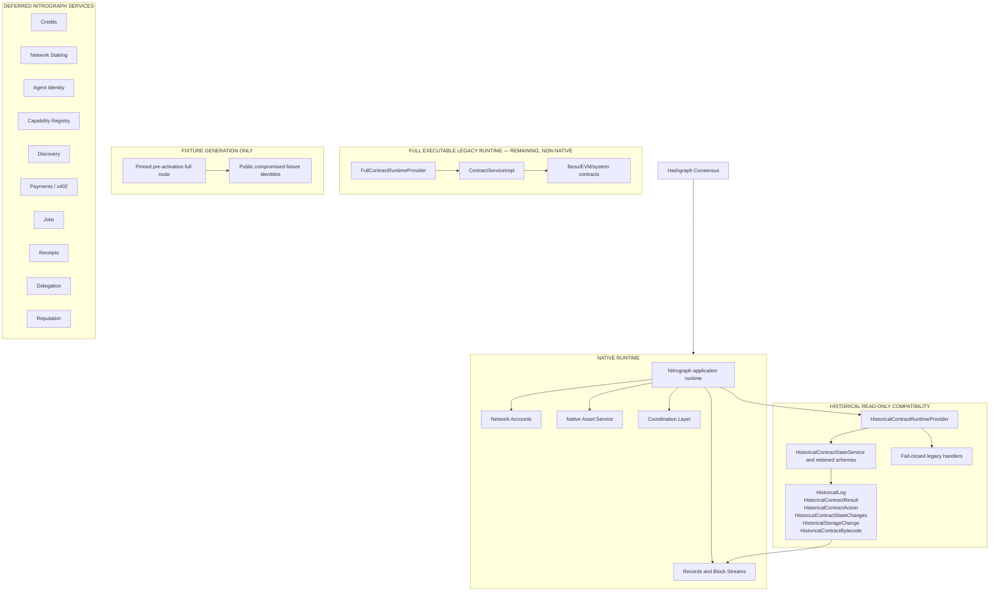

# Nitrograph Runtime Architecture

Status: P06B-6 engineering control artifact

## Control classifications

- **Native runtime:** consensus-facing application services that may execute in Nitrograph mode.
- **Historical compatibility:** retained schemas and neutral values; readable and translatable,
  never executable.
- **Full executable legacy runtime:** retained only to preserve the upstream full distribution and
  controlled fixture generation. It is not selected in Nitrograph mode.
- **Removed:** direct executable runtime types from shared log, result, action, state/storage, and
  bytecode translation.
- **Remaining:** module dependencies and packaged jars supporting the combined full/native build.
- **Deferred:** new Nitrograph services listed above; none are implemented by P06B.

The frozen invariant is: historical contract state remains readable and migratable but is never
executable on Nitrograph.

