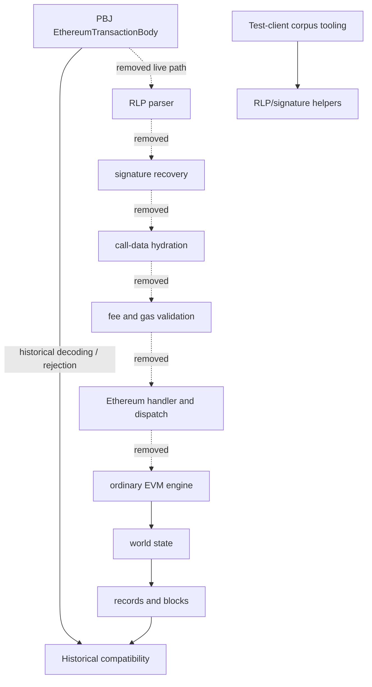

# P07 Ethereum Transaction Execution Ownership

Status: implementation inventory for P07-6.

## Boundary

P07-6 removes live `EthereumTransactionBody` execution. It permanently retains the PBJ/protobuf
body and result models, neutral `EthereumTransactionStreamBuilder`, historical record/block
translation, mirror-facing data, and deterministic native rejection. Ordinary HAPI contract create
and call execution, the EVM engine, world state, and Besu remain for later waves.



Reverse live dependency graph before P07-6:

```text
FullContractRuntimeProvider
  -> ContractServiceImpl / ContractHandlers
    -> EthereumTransactionHandler
      -> EthereumCallDataHydration -> EthTxData
      -> EthTxSigsCache -> EthTxSigs
      -> HevmTransactionFactory / ContextTransactionProcessor
        -> EVM -> world state -> record builders

Handle workflow
  -> hollow-account completion / throttles / fee refund
    -> EthTxData parser and signature recovery
```

## Production ownership

| Component | Previous owner | Consumers | Classification | P07-6 result |
|---|---|---|---|---|
| `EthereumTransactionHandler` | `app-service-contract-impl` | full runtime handler set | `ETHEREUM_RUNTIME`, `DELETE_IN_P07_6` | deleted |
| `EthereumTransactionHandlerFacade` | `hedera-app` | application composition | `ETHEREUM_RUNTIME`, `DELETE_IN_P07_6` | deleted |
| `EthereumCallDataHydration` / `HydratedEthTxData` | contract impl | Ethereum handler/processor | `ETHEREUM_PARSER`, `DELETE_IN_P07_6` | deleted |
| `EthTxSigsCache` | contract impl | hollow-account completion, transaction module | `ETHEREUM_SIGNATURE`, `DELETE_IN_P07_6` | deleted |
| `EthereumFeeCalculator` | contract impl | service fee dispatch | `ETHEREUM_FEE`, `DELETE_IN_P07_6` | deleted |
| Ethereum branches in `HevmTransactionFactory` | contract impl | Ethereum handler | `ETHEREUM_TRANSLATOR`, `DELETE_IN_P07_6` | deleted |
| Ethereum branches in `ContextTransactionProcessor` | contract impl | result externalization | `ETHEREUM_RUNTIME`, `DELETE_IN_P07_6` | deleted |
| Ethereum throttle/gas refund branches | `hedera-app` | handle workflow | `ETHEREUM_GAS`, `DELETE_IN_P07_6` | deleted |
| Ethereum hollow-account completion | `hedera-app` | handle workflow | `ETHEREUM_SIGNATURE`, `DELETE_IN_P07_6` | deleted |
| `EthTxData` / `EthTxSigs` | formerly `hapi-utils` runtime API | test-client corpus only after removal | `ETHEREUM_TEST`, `DEFER_TO_P07_7` | ownership moved to `test-clients`; absent from runtime modules |
| `EthereumTransactionStreamBuilder` | neutral contract API | historical record construction | historical model | retained unchanged |
| PBJ/protobuf Ethereum models | HAPI/PBJ | historical decoding, rejection, mirror | historical compatibility | retained unchanged |
| historical block/record routing | `hedera-app` | historical output | historical compatibility | retained unchanged |
| `BatchTransactionRollbackHandler` | contract impl | ordinary contract call/create atomic batches | ordinary EVM dependency | retained and renamed from misleading legacy name |

## Tests and resources

Implementation, hydration, signature-cache, fee-calculator, and live Ethereum result tests are
deleted or narrowed. The parser/signature unit vectors and HAPI Ethereum corpus remain under
`test-clients`; they are not part of either runtime distribution and are classified for P07-7
because mixed ordinary-contract suites still consume their transaction-construction helpers.
No authenticated P06 fixture generator executes an Ethereum transaction; the corpus retains an
Ethereum body only as one of the five deterministic post-activation rejection probes.

## Dependency decisions

- EVM engine and world-state dependencies: retained for ordinary contract create/call.
- Besu and Tuweni: retained for the later engine/world-state waves.
- Generic cryptography: unchanged.
- RLP/signature tooling: removed from production runtime API and retained only in test clients.
- PBJ, persisted schemas, state identifiers, record builders, mirror models: permanent.
- ServiceLoader entries: none owned the removed execution path.
- JPMS: the runtime export of `com.hedera.node.app.hapi.utils.ethereum` is removed; test clients
  declare their own tooling dependency.

No fixture, historical, mirror, ordinary-contract, world-state, consensus, or platform-sdk
consumer crosses the deleted live execution boundary.
