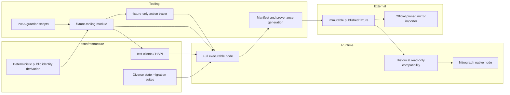

# P07 Fixture Tooling Architecture

## Ownership layers

The only executable direction is tooling to the full node. Runtime code never depends on fixture
tooling. The native node consumes only authenticated output and historical compatibility APIs.

## Artifact boundaries

`fixture-tooling` contains:

- `HistoricalContractStateFixtureCreation`;
- the guarded PEM-writing `P06aFixtureIdentityGenerator`;
- Gradle tasks that run these entry points.
- the minimum fixture-only action collector and its ServiceLoader factory.

It does not contain:

- `ContractServiceImpl`;
- an EVM, Besu, Tuweni, world-state, or system-contract implementation;
- node startup;
- Dagger runtime composition;
- runtime ServiceLoader providers (its provider is present only in the tooling jar);
- release credentials or private keys.

The module is not a dependency of `hedera-app`, the native application artifact, the full
application artifact, or either runtime distribution. It depends on `test-clients` and the full
contract implementation. `fixtureFullNodeDistribution` augments a transient copy of the full node
with the tooling jar; normal distributions remain unmodified.

## Test fixtures and shared infrastructure

Synthetic PBJ values and unit resources remain with the tests that own them. General HAPI
infrastructure and `DiverseStateCreation` remain in `test-clients`. Fixture-only Solidity
orchestration belongs in tooling, but shared Solidity sources and compiled resources remain in
place until later census waves establish unambiguous ownership.

Published authenticated fixtures remain external release assets. Fetch/verification scripts and
manifests are permanent consumers, not generators, and may remain in the repository.

## Mechanical controls

`tools/p07/verify-fixture-tooling-isolated.sh` rejects:

- fixture-only entry points under another production source root;
- runtime JPMS edges to fixture tooling;
- runtime service-provider exposure;
- fixture classes in native or full runtime jars;
- embedding node/runtime implementation in the tooling source.

`tools/p07/test-fixture-tooling-policy.sh` proves rejection of injected source, native/full jar
classes, service metadata, and JPMS edges using temporary artifacts.
