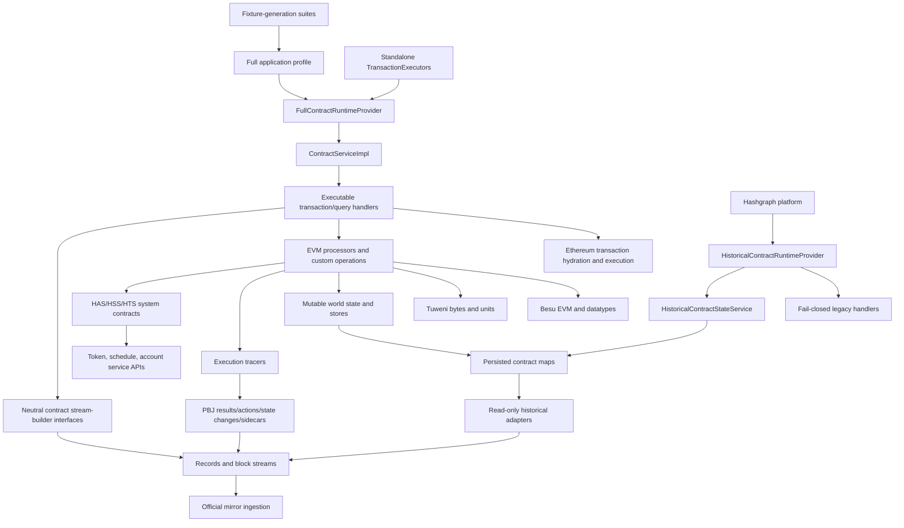
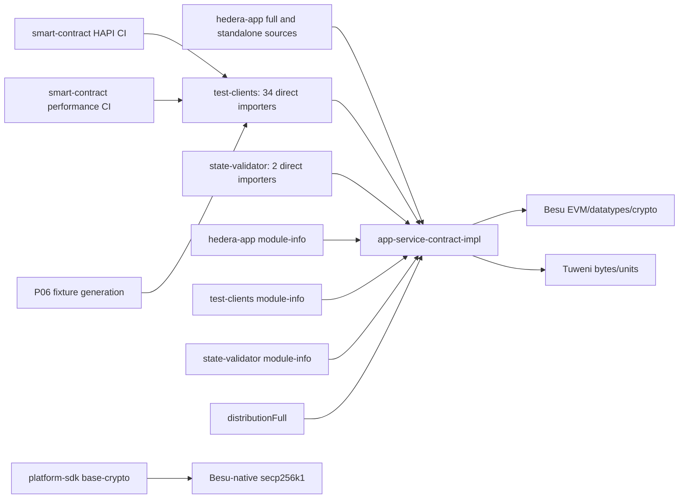

# P07 Repository De-execution Plan

Status: plan complete; no deletion authorized or performed  
Source census: `P07_REPOSITORY_DEEXECUTION_CENSUS.md`  
Protected inventory: `P07_PROTECTED_COMPATIBILITY_INVENTORY.md`

## Objective

Physically remove legacy executable contract infrastructure from repository ownership after P06B
made the Nitrograph native artifact mechanically non-executable. Preserve historical saved states,
PBJ and protobuf models, schemas, identifiers, neutral APIs, records, sidecars, blocks, and mirror
interpretation.

Every removal wave must compile independently and pass its bounded tests. A wave is not allowed to
borrow success from a later cleanup.

## Architecture and dependency graph

### Forward execution graph

The deletion cut is above the neutral builders/PBJ boundary and beside, not through, the historical
provider/state-service path.

### Reverse graph: executable-module consumers

Exact direct import ownership is `test-clients=34`, `hedera-app=16`, and
`hedera-state-validator=2`. Some app imports are the six neutral builder interfaces whose fully
qualified legacy packages are now owned by `app-service-contract`; those are protected and are not
implementation edges.

## Strategy

1. Freeze P06B and its authenticated corpus as the semantic oracle.
2. Remove construction roots and external consumers before implementation internals.
3. Externalize executable fixture generation before removing its runtime.
4. Remove leaf executable producers from the monolithic implementation while keeping each wave
   compiling.
5. Delete the empty implementation module only after all reverse edges are gone.
6. Remove third-party dependencies, JPMS edges, CI, licenses, and notices only after source absence
   proves they are unused.
7. Re-run the full P06 compatibility matrix after every high-risk wave and at final exit.

## Compile-safe removal schedule

The suggested Besu-before-EVM order is not compile-safe: production EVM sources import Besu. This
plan removes the EVM integration source first, then removes the now-unused Besu/Tuweni dependencies.

| Wave | Removal | Compile fallout and required moves | Tests / fixtures / docs / CI | Blast radius and gate |
|---:|---|---|---|---|
| 1 | Standalone execution | Delete `workflows/standalone/**`; remove `StandaloneFeeCalculatorImpl` dependency on `TransactionExecutors`; remove standalone Dagger component and app exclusions | Remove or replace standalone-only tests; full node and fixture generator remain | Medium. App compile, native/full build, historical lifecycle |
| 2 | Fixture-only executable tooling | Dedicated `fixture-tooling` module owns the P06A historical population entry point and guarded PEM-writing command; general HAPI/migration infrastructure remains in `test-clients`; retrieval/verification remains permanent | Published source commit, toolchain, transaction sequence, identity, hashes, and regeneration contract remain frozen | COMPLETE after exact-head lifecycle/mirror/CI gates; existing fixtures remain independently consumable |
| 3A | Isolate concrete fixture tracing | **COMPLETE.** `EvmActionTracer`, action stack, wrappers, helpers, and factory are fixture-tooling-only. | Preserve authenticated three-action/seven-sidecar reproduction. | Complete |
| 3B | Remove runtime tracer aggregation and concrete producers | **COMPLETE.** Normal runtime uses `NoTracer`; concrete fixture tracers are absent from native and full runtime artifacts. | Preserve neutral historical action interpretation. | Complete |
| 3C | Remove residual callback protocol | **DEFERRED TO WAVES 4–8.** `ActionSidecarContentTracer`, factory seam, `NoTracer`, and propagation remain only in executable legacy source. | Delete each callback with its owning system-contract, Ethereum, world-state, Bonneville, or EVM processor. No fixture-specific EVM processor duplication. | `LEGACY_EXECUTION_SEAM_DEFERRED_TO_ENGINE_REMOVAL` |
| 4 | System contracts | Remove `exec/systemcontracts/**`, its Dagger bindings, executable precompile tests, and full-only service hooks | Retain token/account/schedule native APIs; remove smart-contract precompile CI partitions | Very high. Native token/account suites and protected historical streams must pass |
| 5 | Solidity execution assets | Remove full-only Solidity execution/query handlers and compiler/source fixtures no longer needed after Wave 2 | Retain wire names such as `getBySolidityID`, address widths, PBJ fields, and historical query rejection | Medium. Do not cosmetically rename historical fields |
| 6 | Ethereum execution | **COMPLETE (P07-6).** Live handler, hydration, signature cache, fee/gas branches, dispatch, and runtime parser ownership removed. Test-client corpus helpers remain until their mixed-suite consumers retire. | Retain Ethereum PBJ bodies/results for decoding, rejection, and mirror | Closed: historical and exact-head runtime importer regressions pass; new runtime actions are deterministically zero |
| 7 | Separate world-state implementation removal | **BLOCKED AND SUPERSEDED.** Mutable stores, updaters, frame state, proxy accounts and commit/rollback are inseparable from ordinary executable EVM processing | Neutral historical interfaces and read-only adapters are already separate and remain protected | Replaced by P07-8: retire executable contract execution and mutable world state atomically |
| 8 | EVM engine integration | **COMPLETE AND MERGED.** HEVM, frame runners, processors, mutable world state, tracer seam, executable handlers, and full provider construction are absent. | Two immutable fixtures distinguish preactivation loading from four-node post-write restart/reconnect; three separate mirror corpora pass. | Merged as `6f91c0121616960dc5e60471f995a0607587966a` |
| 9 | Besu/Tuweni and executable native dependencies | Remove app/test-client JPMS edges and version-catalog/dependency metadata after source scans are zero | Remove notices/SBOM components only when no retained artifact carries them | Blocked at `platform-sdk/base-crypto` without upstream neutral verifier or separate platform authorization |
| 10 | `app-service-contract-impl` module | **P07-9 IMPLEMENTED.** Legacy-FQN schema forwarders moved unchanged to the neutral owner; conversion residue moved to test clients; dead opcode utility and project shell deleted. | `RecordStreamBuilder`, six builder interfaces, historical schemas/stores remain in neutral API | Exact-head fixture, reconnect, mirror, and CI gates pending |
| 11 | Gradle cleanup | Remove full distribution task/profile, implementation dependency edges, fixture-only configurations, unused versions/plugins | Preserve native distribution and neutral API publications | Medium. Run all builds and dependency analysis |
| 12 | JPMS/service cleanup | Remove implementation/Besu/EVM/Tuweni requires, full providers, executable `uses/provides`, reflection strings, Dagger generated roots | Preserve historical factories and retained legacy builder packages | Medium. Module graph and isolated classpath policy must pass |
| 13 | CI cleanup | Remove smart-contract execution, standalone, full-runtime, Solidity, and performance jobs; retain P06 historical lifecycle/mirror gates | Update change detection and required-check policy explicitly | High governance risk. Never remove a required check before replacement is active |
| 14 | Documentation/licensing cleanup | Remove executable-operation docs and obsolete notices; mark full runtime retired | Preserve all P06/P07 evidence, fixture provenance, historical field documentation, unresolved findings | Low source risk, high audit importance |

## Wave validation levels

### Every wave

- Changed modules compile.
- Native distribution builds and passes binary dependency policy.
- No protected file, state key, PBJ/protobuf definition, codec, state ID, schema version, or service
  identifier changes.
- Secret and developer-path audits pass.

### Waves 3–10

- Native startup and historical provider/store selection.
- Authenticated historical reopen, save, restart, and replay.
- Five legacy bodies reject with `INVALID_TRANSACTION_BODY`.
- `STORAGE`, `BYTECODE`, `EVM_HOOK_STATES`, and `LAMBDA_STORAGE` remain unchanged.
- Record, sidecar, and block golden fingerprints remain unchanged.

### Waves 4, 6, 7, 8, 9, and 10

- Real four-node reconnect and state synchronization.
- Post-reconnect account, asset, and Coordination Layer processing.
- Official mirror record, sidecar, and block ingestion.
- Exact native classpath absence policy.

## Recommended Wave 1 implementation

Implementation status: **COMPLETE** on
`p07/remove-standalone-execution`. Production standalone sources and their
standalone-only tests have been removed. The authenticated fixture path was
confirmed to use the pinned full node rather than `TransactionExecutors`.
The exact-head lifecycle, reconnect, synchronization, official mirror, and CI
gates pass.

Wave 1 should be a bounded PR titled:

`P07-1: remove standalone executable transaction infrastructure`

Allowed production scope:

- `hedera-node/hedera-app/src/main/java/com/hedera/node/app/workflows/standalone/**`
- `hedera-node/hedera-app/src/main/java/com/hedera/node/app/fees/StandaloneFeeCalculatorImpl.java`
- exact Dagger/JPMS/build references required by those classes

Expected deletions are seven production standalone files (45,423 source bytes) plus three direct
standalone tests and dependent fee/record tests that cannot be expressed without the executor.

Before deletion, trace callers of `StandaloneFeeCalculatorImpl`. If it supports a permanent native
fee API, extract only its neutral calculator contract; do not retain `TransactionExecutors`.

Wave 1 acceptance:

- `TransactionExecutors` and `ActionSidecarContentTracer` are absent from app production source.
- Native and full application compilation succeeds.
- No standalone Dagger component or service entry remains.
- Fixture generation still uses the full node path, not standalone execution.
- All P06 native lifecycle, map, rejection, reconnect, synchronization, and mirror gates remain
  valid.

## Wave 2 implementation

Status: **COMPLETE** on `p07/externalize-fixture-execution-tooling`.

- `HistoricalContractStateFixtureCreation` moved from the test-client production artifact to the
  dedicated `fixture-tooling` module.
- PEM-writing and command-line parsing moved from the reconnect identity utility into
  `P06aFixtureIdentityGenerator` in the tooling module.
- `P06aPublicFixtureIdentity.fixtureKeysAndCerts()` remains in `test-clients` because it is shared
  by the real four-node reconnect harness and does not write or publish identity material.
- `DiverseStateCreation` remains paired with `DiverseStateValidation` as general full-node migration
  test infrastructure.
- No Solidity corpus was broadly moved or deleted.
- Runtime distributions have no dependency on or packaged class from `fixture-tooling`.
- The exact-head four-node reconnect, state synchronization, historical-map comparison, official
  mirror record/sidecar/block ingestion, full-runtime tests, and isolation policies pass.

Wave 3A (fixture tracer isolation) and Wave 3B (runtime aggregation/concrete-producer removal) are
**COMPLETE**. Wave 3C, the residual callback protocol, is
`LEGACY_EXECUTION_SEAM_DEFERRED_TO_ENGINE_REMOVAL`: duplicating frame, message, HEVM, Bonneville,
and result processors in fixture tooling was rejected. Callback paths now collapse with their
owning processors in Waves 4–8.

Wave 4 (system-contract removal) is **COMPLETE** on `p07/remove-system-contracts`. It deletes the EVM-facing registries,
translators, calls, redirects, ABI method registry, Dagger composition, and secondary metrics for
addresses `0x167`–`0x16c`. Native token, account, schedule, exchange-rate, randomness, and hook
services remain. Generic EVM precompiles and the ordinary `0x16d` account-hook execution seam are
deferred to their owning engine waves.

Wave 5 should remove only Solidity execution assets and tooling with proven dead ownership. Start
with the deleted system-contract interfaces, ABI fixtures, compiler tasks, and generated bytecode
that have no fixture-tooling, ordinary-Ethereum, or historical-consumer edge. Retain general
contract fixtures, the pinned compiler inputs needed by authenticated fixture reproduction, and
Ethereum execution vectors for their later owning wave. The Wave 5 census must identify compiler
version/settings, metadata stripping, generated-bytecode hashes, and every test-client resource
consumer before deleting a resource.

Wave 5 is implemented on `p07/remove-dead-solidity-assets`. Its closed deletion set removes 44
system-contract-only Solidity inputs, 43 paired ABI files, and 43 paired bytecode files (130 files,
716,068 bytes). No shared compiler task is removed: retained general-contract, fixture, Ethereum,
and EVM vectors still use the common compiler paths. Wave 6 should census and then remove
Ethereum-transaction execution while retaining generic EVM execution until its later wave.

Wave 6 is implemented on `p07/remove-ethereum-transaction-execution`. Live Ethereum handlers,
RLP/signature recovery, call-data hydration, fee/gas special cases, dispatch, and result
externalization have been removed from runtime ownership. The same parser FQNs remain only in
`test-clients` for mixed corpus construction; PBJ/protobuf and historical Ethereum models remain
protected. Ordinary HAPI contract create/call, the EVM engine, world state, Besu, and generic
cryptography remain. Builds, policies, fixture verification, and the exact-head reconnect pass;
official mirror database ingestion passes at the pinned importer commit after refreshing the
validation user's already-configured Docker group with `sg docker`. The historical corpus retains
three actions; the exact-head runtime corpus has zero actions under the intended `NoTracer`
composition. Wave 6 is **COMPLETE**.

Wave 7 should begin with a world-state ownership census. It should distinguish executable
`RootProxyWorldUpdater`/`ProxyWorldUpdater`/account-storage mutation implementations from the
permanent neutral retained-map interfaces and read-only historical adapters. The first bounded
implementation should remove only world-state implementations with no ordinary EVM execution
consumer; if ordinary create/call still requires the entire world-state closure, record an
architecture blocker rather than broadening into EVM-engine removal.

The P07-7 census reached that stop condition and the separate deletion wave is **BLOCKED AND
SUPERSEDED**. `ContextTransactionProcessor`, Besu frame
construction, ordinary create/call commit, storage validation/rent, created-contract/nonce
externalization, and authenticated full-node fixture generation all require the same mutable
updater closure. There is no independently deletable production subset. No world-state source was
deleted. The closure is deferred until ordinary EVM execution is explicitly retired; neutral
historical interfaces, read-only adapters, schemas, and retained maps remain independent and
protected. Its replacement phase is P07-8, which retires executable contract processing and
mutable world state atomically after fixture compatibility ownership is frozen.

## Risk assessment

| Risk | Severity | Evidence | Control |
|---|---|---|---|
| Persisted schema or identifier accidentally deleted with implementation schemas | Critical | Implementation still contains duplicate/full V0.49/V0.65 schemas while neutral history schemas are authoritative | Protected inventory plus state-key/codecs diff guard |
| Test-client utilities mix generic address behavior with executable helpers | High | 34 direct implementation importers and cross-suite static imports | Classify each utility; move only proven generic PBJ/byte behavior |
| System-contract removal damages native token/account tests | High | 183 production system-contract files coupled to token/schedule/account APIs | Remove callers, not native APIs; run native service suites |
| Fixture authenticity becomes non-reproducible | Critical | Current generation needs pinned full runtime | Freeze/externalize tooling before executable source removal |
| Tracer deletion changes fixture reproduction | Critical | Live PBJ actions have no producer other than `EvmActionTracer`/`ActionStack`; authenticated corpus contains three actions | Stop Wave 3; authorize fixture-only producer ownership or revise the fixture contract |
| Platform crypto prevents total Besu removal | Critical | One protected `platform-sdk/base-crypto` Besu verifier and JPMS edge | Stop Wave 9; require upstream neutral release or separate approval |
| CI deletion hides regressions | High | Smart-contract jobs are transitively enabled by several workflows | Establish replacement historical gates before changing required checks |
| Historical “EVM/Solidity/gas” names mistaken for execution | High | Permanent PBJ, schema, and mirror fields retain legacy terminology | Protected inventory; prohibit cosmetic removal or renaming |
| Full distribution retirement changes app composition broadly | High | Full and native profiles share common app source | Remove full-only factories after consumers, keep common lifecycle unchanged |
| Licensing claims become inaccurate | Medium | Full distribution currently retains all P06B-removed components | Recompute exact source/binary SBOM; do not infer license removal from one jar |

## Estimated repository reduction

Directly measured candidate material:

- Contract implementation source: 686 files / 4,185,454 bytes.
- Contract HAPI suite Java: 191 files / 4,384,846 bytes.
- Contract test resources: 1,017 files / 4,326,334 bytes.
- Standalone production source: 7 files / 45,423 bytes.

This establishes a conservative direct range of approximately **1,700–1,900 files** and
**12–15 MB** of checkout source/resources, before counting cross-suite executable tests, CI YAML,
generated dependency metadata, or documentation. The larger benefit is dependency and licensing
surface reduction: the 14 executable artifacts already removed from native packaging become
removable from full/repository build graphs after Wave 10.

No Git pack-size, clone-time, or build-time reduction is claimed until a deletion branch measures it
against this base.

## Wave 8 implementation status

P07-8 retires ordinary executable contract processing and mutable world state as the single
cohesive subsystem identified by P07-7. The immutable
`p07-executable-fixture-compat-v1` release preserves executable fixture reproduction at source
commit `64da043f766da29d0fd3e20e3f51051fdd31f5a1`; production application composition now selects
historical compatibility only. Executable handlers, processors, mutable accounts and storage,
world updaters, the residual live tracer seam, and full-runtime provider/store factories are
deleted. The former full distribution is a non-executable alias of the native application.

P07-8 merged after the additive four-node post-write fixture proved restart, genuine reconnect,
state synchronization, `STORAGE=424242`, and official mirror ingestion without restoring
production execution.

P07-9 physically removes `app-service-contract-impl`. The two deprecated schema forwarders retain
their exact FQNs inside `app-service-contract`; the reduced EVM conversion helper is test-client
owned; the unused opcode helper and build/JPMS shell are deleted. Remaining Besu/Tuweni ownership
is test/tooling or the separately protected `platform-sdk/base-crypto` secp256k1 boundary.

## Stop gates

Stop the affected route immediately if a wave requires:

- changing PBJ/protobuf definitions, persisted keys, codecs, state IDs, schema versions, or service
  identifiers;
- modifying historical output or official mirror semantics;
- redesigning the neutral compatibility API;
- changing consensus;
- changing `platform-sdk` without separate authorization;
- retaining executable behavior to interpret historical data.
