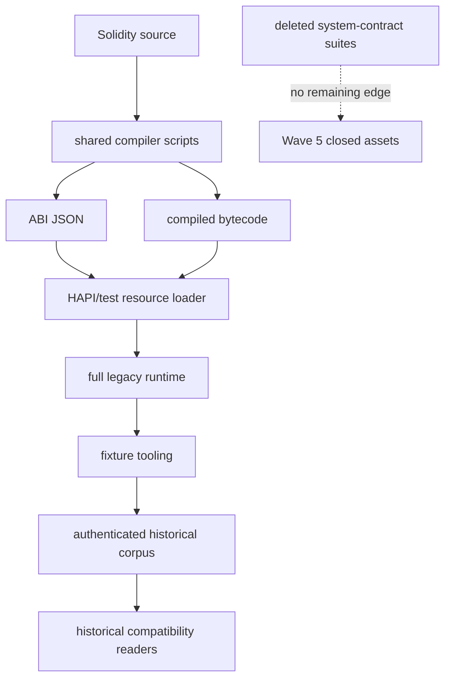

# P07 Solidity Asset Ownership

## Scope and census method

The P07-5 census starts from every tracked `.sol`, `.bin`, `.abi`, contract JSON, compiler
script, Gradle edge, CI workflow, and Java resource lookup. It then follows both Java consumers
and Solidity imports. A directory is `DELETE_IN_P07_5` only when neither graph has an edge from a
retained asset.

Before P07-5 the repository contained 309 Solidity files. The principal executable corpus was
`hedera-node/test-clients/src/main/resources/contract/contracts`, with 271 contract directories,
288 Solidity inputs, 269 compiled binaries, and 268 ABI JSON files. The remaining Solidity inputs
are test or benchmark resources outside that corpus.

The only general compiler entry point under the corpus is
`test-clients/src/main/resources/contract/solidity/compile.sh`. It supports `solcjs` and optimized
`solc --via-ir`; `OpcodesContract/recompile.sh` is an ordinary EVM opcode-vector generator. Both
remain because retained general-contract and EVM vectors consume their behavior. No production
Gradle task, artifact publication, or CI job regenerates the deleted Wave 5 assets.

## Ownership classifications

| Classification | Ownership and dependency | P07-5 decision |
|---|---|---|
| `SYSTEM_CONTRACT_ONLY` | Solidity façades and compiled ABI/bytecode formerly consumed by the deleted HTS/HAS/HSS, PRNG, redirect, and system-contract HAPI suites | Delete only the closed, unreferenced set |
| `GENERAL_CONTRACT` | ordinary create/call, logs, storage, revert, create2, self-destruct, opcode, and hook vectors | Retain |
| `FIXTURE_REQUIRED` | `CreateTrivial`, `SimpleStorage`, and fixture-tooling full-node inputs | Retain; authenticated fixture inputs and hashes are protected |
| `ETHEREUM_REQUIRED` | Ethereum transaction, relay, signature, and execution test vectors | Retain for P07-6 |
| `EVM_REQUIRED` | opcode, frame, precompile, gas, create, call, and world-state vectors | Retain for their owning engine waves |
| `PBJ_REQUIRED` | None of the Solidity resources own PBJ models | PBJ remains outside this deletion |
| `HISTORICAL` | Published record/sidecar/block corpora and generated historical bytecode | Retain permanently |
| `DELETE_IN_P07_5` | 44 closed directories: 44 Solidity files, 43 ABI JSON files, and 43 compiled binaries | Delete |
| `DEFER_TO_P07_6` | retained Ethereum-only Solidity and bytecode vectors | Inventory next; do not delete here |
| `UNKNOWN` | Any resource with an unresolved Java lookup, Solidity import, fixture edge, or generated provenance | Retain until resolved |

## Deleted closed set

The deleted set is:

`AssociateTryCatch`, `AutoCreationModes`, `ChildCallDataSizeCheck`, `ClassicQueriesXTest`,
`CreateTokenVTwo`, `DeleteTokenContract`, `DirectPrecompileCallee`, `DoTokenManagement`,
`ERC721ContractWithHTSCalls`, `FreezeUnfreezeContract`, `GracefullyFailingPrng`,
`HbarFeeCollector`, `HtsApproveAllowance`, `ImmediateChildAssociation`, `InstantStorageHog`,
`MinimalTokenCreations`, `MixedBurnToken`, `MixedFramesScenarios`, `MultiversionBurn`,
`NegativeAssociationsContract`, `NegativeBurnContract`, `NegativeDissociationsContract`,
`NegativeHtsTransferFrom`, `NegativeMintContract`, `NestedBurn`, `NestedLazyCreateContract`,
`NewTokenCreateContract`, `NonDelegateCryptoTransfer`, `PauseUnpauseTokenAccount`,
`RedirectNullContract`, `RedirectTestContract`, `SafeOperations`, `SomeERC20Scenarios`,
`SomeERC721Scenarios`, `SpecialQueriesXTest`, `TestApprover`,
`TokenDefaultKycAndFreezeStatus`, `TokenExpiryContract`, `TokenMiscOperations`,
`TransferAmountAndToken`, `UpdateTokenFeeSchedules`, `VersatileTransfers`, `WorkingHours`, and
`ZenosBank`.

The set contains 130 files and 716,068 bytes. Every directory has zero Java/runtime/tooling
consumers and zero Solidity imports from a retained directory. Shared interfaces such as
`IHederaTokenService`, `IHederaScheduleService`, shared helpers, and any resource referenced by
ordinary EVM or Ethereum tests remain.

## Dependency graph



Reverse graph:

```text
historical compatibility <- authenticated corpus <- fixture tooling <- pinned full node
ordinary EVM/Ethereum tests <- resource loader <- retained ABI/bytecode <- retained Solidity
deleted system-contract tests <- deleted ABI/bytecode/Solidity
```

Runtime code does not depend on Solidity source or compiler scripts. Historical readers consume
wire output, never compiler inputs.

