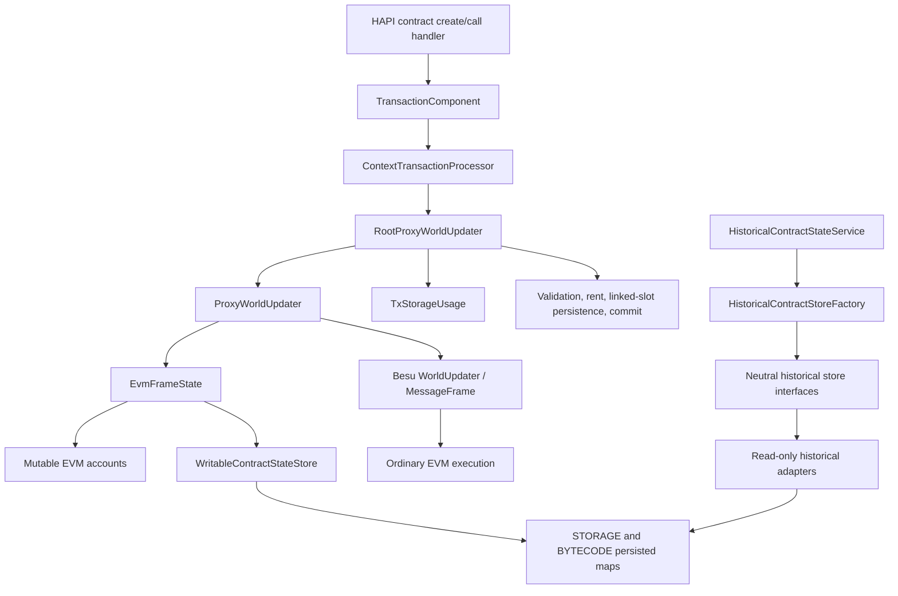

# P07 Executable World-State Ownership

Status: **ARCHITECTURE BLOCKED** at the P07-7 stop gate.

No production source was changed or deleted. The census was made from merge
`d41e7c2cb3e710b37f095cd68e46284a0f4fd9bf`.

## Finding

Ordinary HAPI contract create and call execution fundamentally depend on the complete mutable
world-state closure. `ContextTransactionProcessor` is constructed with a
`RootProxyWorldUpdater`, passes it into frame execution, reads created contracts/nonces and
transaction storage usage from it, and calls `commit()` after successful execution. Besu
`MessageFrame` construction requires the updater returned by `HederaWorldUpdater.updater()`.

Removing the mutable world-state implementation while retaining ordinary EVM execution would
therefore require a replacement executable world state. That is an EVM architecture redesign and
is outside P07-7.

The historical branch is independent of the executable world state and remains protected.

## Measured closure

- Executable `impl/state` production files: **27**
- Executable `impl/state` production bytes: **148,189**
- Files in that package importing Besu directly: **15**
- Files in that package importing Tuweni directly: **12**
- Direct production closure referencing `RootProxyWorldUpdater`, `ProxyWorldUpdater`, or
  `EvmFrameState`: **40 files / 448,448 bytes**
- Direct state tests: **10 files / 92,420 bytes**

These measurements exclude downstream tests, `IterableStorageManager`, and generic EVM processors
that reach the world state through `HederaWorldUpdater`.

## Ownership and classification

| Component | Owner | Consumers and dependencies | Historical / fixture relevance | Classification |
|---|---|---|---|---|
| `HederaWorldUpdater` | contract implementation `hevm` | frame builder, gas charging, EVM transaction/result processing; extends Besu `WorldUpdater` | Full-node fixture execution requires it; historical reading does not | `WORLD_STATE_RUNTIME`, `DEFER_TO_P07_8` |
| `RootProxyWorldUpdater` | contract implementation `state` | transaction processor; commit, storage validation/rent, created IDs/nonces | Fixture ordinary create/call requires it | `WORLD_STATE_MUTATION`, `DEFER_TO_P07_8` |
| `ProxyWorldUpdater` | contract implementation `state` | root/query updaters, custom operations, frame utilities; nested Besu mutation and revert | Fixture execution requires it | `WORLD_STATE_MUTATION`, `DEFER_TO_P07_8` |
| `DispatchingEvmFrameState` | contract implementation `state` | transaction-scoped state factory; mutable accounts/storage/code/nonces | Fixture execution requires it | `WORLD_STATE_MUTATION`, `DEFER_TO_P07_8` |
| `EvmFrameState` | contract implementation `state` | updater and account proxies; live EVM reads/writes | No historical reader dependency | `WORLD_STATE_RUNTIME`, `DEFER_TO_P07_8` |
| `EvmFrameStateFactory`, `ScopedEvmFrameStateFactory`, `EvmFrameStates` | contract implementation state/Dagger | constructs executable state for transaction and query frames | Fixture execution requires it | `WORLD_STATE_RUNTIME`, `DEFER_TO_P07_8` |
| mutable/proxy EVM account classes | contract implementation `state` | Besu message-frame account operations; balance, nonce, code, storage | No historical reader dependency | `WORLD_STATE_MUTATION`, `DEFER_TO_P07_8` |
| `PendingCreation` | contract implementation `state` | updater and create operations | Fixture contract creation requires it | `WORLD_STATE_MUTATION`, `DEFER_TO_P07_8` |
| implementation `ContractStateStore` | contract implementation `state` | frame state and storage manager; mutable bytecode/slot contract | Not the protected neutral API | `WORLD_STATE_MUTATION`, `DEFER_TO_P07_8` |
| implementation `ReadableContractStateStore` | contract implementation `state` | full-runtime query/store factory | Historical mode uses a separate neutral adapter | `WORLD_STATE_RUNTIME`, `DEFER_TO_P07_8` |
| `WritableContractStateStore` | contract implementation `state` | full-runtime handle store; writes `STORAGE`/`BYTECODE` and counters | No historical reader dependency | `WORLD_STATE_MUTATION`, `DEFER_TO_P07_8` |
| `StorageAccess`, `StorageAccesses`, `StorageSizeChange`, `TxStorageUsage`, `RentFactors` | contract implementation `state` | mutation journal, result production, rent/storage managers | Historical PBJ/neutral state changes do not depend on these classes | `WORLD_STATE_MUTATION`, `DEFER_TO_P07_8` |
| hook frame state/factory/proxy | contract implementation `state/hooks` | executable `0x16d` hook code/storage and Besu accounts | Historical `EVM_HOOK_STATES` reading is separate | `WORLD_STATE_RUNTIME`, `DEFER_TO_P07_8` |
| neutral `ReadableContractStateStore` | `app-service-contract` | application store factories; no executable dependency | Required permanently for historical access | `HISTORICAL_INTERFACE` |
| `HistoricalReadableContractStateStore` | `app-service-contract/history` | `HistoricalContractStoreFactory` | Permanent read-only compatibility contract | `HISTORICAL_INTERFACE` |
| `HistoricalReadableEvmHookStore` | `app-service-contract/history` | historical store factory | Permanent `EVM_HOOK_STATES` compatibility | `HISTORICAL_INTERFACE` |
| `HistoricalContractStoreFactory` adapters | `hedera-app` | native historical runtime; neutral interfaces only | Reads retained maps | `HISTORICAL_ADAPTER` |
| `HistoricalContractStateService` and V0.49/V0.65 schemas | neutral compatibility ownership | native startup and saved-state reopening | Persisted names, IDs, keys, codecs and order are protected | `HISTORICAL_ADAPTER` |

## Commit, rollback, and savepoint dependency

`RootProxyWorldUpdater.commit()` performs behavior required for successful ordinary contracts:

1. collects transaction storage accesses;
2. validates final slot usage;
3. charges storage rent;
4. rewrites linked storage slots;
5. summarizes created contracts and updated nonces;
6. enforces creation throttling;
7. commits the nested Besu updater.

`ProxyWorldUpdater.updater()`, `commit()`, and `revert()` provide the nested mutation semantics used
by Besu call frames. Savepoint-backed Hedera operations supply the native state underneath this
updater. These are executable semantics, not historical adapters.

## Fixture and protected-boundary impact

The authenticated fixture is generated through a pinned full node and includes ordinary contract
creation/call output. Its live execution path constructs the same transaction component and mutable
world state. Removing this closure without retiring ordinary EVM execution would make fixture
reproduction impossible.

The fixture and historical data remain unchanged. P07-7 must not alter the `ContractService`
persisted name; retained maps; schemas; state IDs, keys or codecs; PBJ/protobuf models; neutral
historical store interfaces/adapters; or historical records, sidecars and blocks.

## Stop-gate result

`DELETE_IN_P07_7`: **none**.

Every executable mutation component is directly required by ordinary EVM create/call or belongs to
the same atomic updater/commit closure. Deleting only a subset would leave a non-compiling or
behaviorally incomplete execution pipeline.

The bounded P07-7 deletion plan is rejected. Physical deletion must be combined with an authorized
retirement of ordinary EVM execution in the engine-removal wave.
